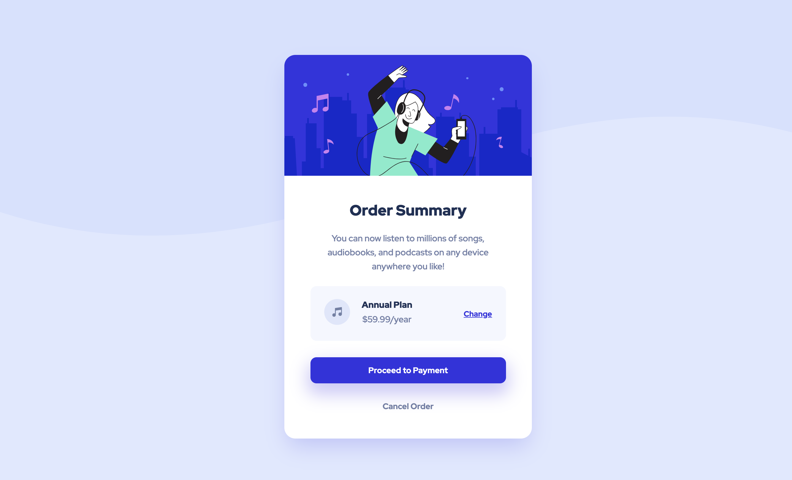

# Frontend Mentor - Order summary card solution

This is my solution to the [Order summary card challenge on Frontend Mentor](https://www.frontendmentor.io/challenges/order-summary-component-QlPmajDUj). Frontend Mentor challenges help you improve your coding skills by building realistic projects.

## Table of contents

- [Overview](#overview)
  - [The challenge](#the-challenge)
  - [Screenshot](#screenshot)
  - [Links](#links)
  - [Built with](#built-with)

## Overview

### The challenge

Users should be able to:

- See hover states for interactive elements

### Screenshot

### Links

- Solution URL [**here**](https://github.com/KristineSoncika/FEM-order-summary-component)
- Live Site URL [**here**](https://kristinesoncika.github.io/FEM-order-summary-component/)

### Built with

- Semantic HTML5 markup
- CSS custom properties
- Mobile-first workflow
